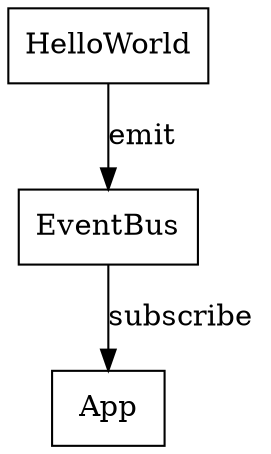
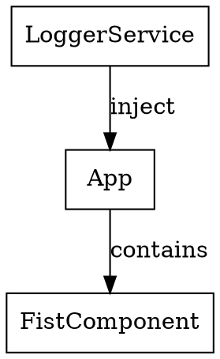
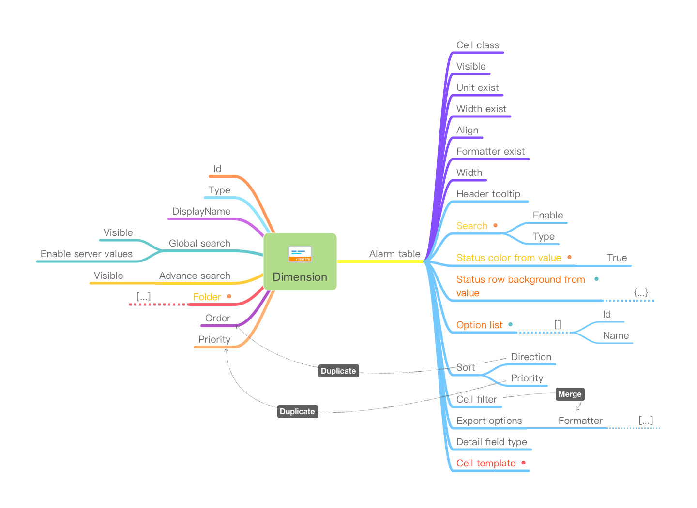

# Angular 学习笔记

## 环境搭建

- 实验环境: MAC, VsCode with plunings

- 安装 angular cli

``` sudo npm i -global @angular/cli ``` 

- 使用 angular cli创建project

```  ng new angularStudy --routing --style=scss ```

- Repository:
git@codehub.devcloud.cn-east-3.huaweicloud.com:Angularxx00001/angularStudy.git

- 测试
  运行 ``` ng serve ``` 默认URL: https://localhost:4200

- 典型项目结构

my-app/
├── node_modules/
├── src/
│   ├── app/
│   │   ├── components/
│   │   │   └── my-component/
│   │   │       ├── my-component.component.ts
│   │   │       └── my-component.component.html
│   │   ├── services/
│   │   │   └── my-service.service.ts
│   │   └── app.module.ts
│   ├── assets/
│   │   └── images/
│   ├── environments/
│   │   ├── environment.prod.ts
│   │   └── environment.ts
│   └── index.html
├── .gitignore
├── package.json
├── tsconfig.json
└── angular.json
  
node_modules/目录存储了项目的所有依赖项。
src/目录存储了项目的源代码。
src/app/目录存储了项目中所有的Angular组件、服务和模块。
src/app/components/目录存储了项目中所有的Angular组件。
src/app/services/目录存储了项目中所有的Angular服务。
src/assets/目录存储了项目中的静态资源（如图像、样式表和字体）。
src/environments/目录存储了项目的环境配置文件。
src/index.html是项目的主HTML文件，包含链接到Angular的JavaScript和CSS文件。
.gitignore文件用于排除不需要提交到版本控制系统（如Git）的文件。
package.json文件存储了项目的所有依赖项和脚本命令。
tsconfig.json文件定义了项目的TypeScript编译配置。
angular.json文件是Angular项目的配置文件，用于配置项目的构建和部署选项。它包含了项目的所有配置设置，例如：
- 源代码目录
- 编译选项
- 构建设置
- 部署选项
- 项目架构
angular.json文件用于管理项目的构建和部署流程，确保构建和部署过程中的一致性和可重复性。它帮助开发人员在多个开发环境之间共享配置信息，使项目在不同的环境中更容易构建和部署

## 组建

组件是 Angular 应用的主要构造块。每个组件包括如下部分：

一个 HTML 模板，用于声明页面要渲染的内容

一个用于定义行为的 TypeScript 类

一个 CSS 选择器，用于定义组件在模板中的使用方式

（可选）要应用在模板上的 CSS 样式

通过ng generate 命令创建  https://angular.cn/cli/generate#component-command

```ng generate component hello-world```

检查module定义文件，根据运行的参数和路径不同，可能需要手动在文件中添加组建导入和声明

app.module.ts
```ts
...

import { HelloWorldComponent } from './components/hello-world/hello-world.component';

...

@NgModule({
  declarations: [
    AppComponent,
    HelloWorldComponent
  ],
  ...

  ```

清除 app.component.html中的内容，替换为

```html
<app-hello-world></app-hello-world>
  ```


- 生命周期

钩子顺序
1	OnChanges
2	OnInit
3	DoCheck
4	AfterContentInit
5	AfterContentChecked
6	AfterViewInit
7	AfterViewChecked
8	DoCheck
9	AfterContentChecked
10	AfterViewChecked
11	OnDestroy

示例：

```ts
import { Component, OnInit, OnDestroy, OnChanges, SimpleChanges } from '@angular/core';

@Component({
    selector: 'app-hello-world',
    templateUrl: './hello-world.component.html',
    styleUrls: ['./hello-world.component.scss']
})
export class HelloWorldComponent implements OnInit, OnDestroy, OnChanges{
    ngOnInit(): void {
        console.error(`OnInit`)
    }
    ngOnDestroy(): void {
        console.error(`ngOnDestroy`)
    }
    ngOnChanges(changes: SimpleChanges): void {
        console.error(`onChanges :${changes}`)
    }
    
}
  ```

- 视图封装
  
在 Angular 中，组件的样式可以封装在组件的宿主元素中，这样它们就不会影响应用程序的其余部分。

Component 的装饰器提供了 encapsulation 选项，可用来控制如何基于每个组件应用视图封装。

```ts
@Component({
  selector: 'app-no-encapsulation',
  template: `
    <h2>None</h2>
    <div class="none-message">No encapsulation</div>
  `,
  styles: ['h2, .none-message { color: red; }'],
  encapsulation: ViewEncapsulation.None,
})
export class NoEncapsulationComponent { }
  ```

- 组建通讯
  - 父到子
  1. 在子组件申明输入属性 ``` Input () msg!:string ```
  2. 在父组件模版中传入值 ``` <app-hello-world [msg]="appMsg"></app-hello-world> ```
   
  还有别的方法，比如@ChildView

  - 子到父 
  1. 在子组件中申明输出事件 ```@Output() emitter = new EventEmitter<string>() ```
  2. 在子组件中添加按钮触发输出事件
      ```html
      <button (click)="reply()">reply</button>
      ```
      ```ts
      reply() {
        this.emitter.emit('reply from hello world')
      }
      ```
  3. 在父组件中接受并处理事件
      ``` html
      <app-hello-world [msg]="appMsg" (emitter)="handleEmitter($event)"></app-hello-world>
      ```
      ``` ts
      handleEmitter(msg:string){
        this.msgFromHelloWorld = msg
      }
      ```
  - 子到子
    基于service.

- 响应式数据
  
  测试对象和数组的响应

  ```ts

  import { Component, Input, Output, EventEmitter, ApplicationRef } from '@angular/core';

  @Component({
      selector: 'app-hello-world',
      // templateUrl: './hello-world.component.html',
      template: `<p>{{arr|json}}</p><button (click)="changeArr()">change</button>
                 <p>{{obj|json}}</p><button (click)="changeObj()">change</button>`,
      styleUrls: ['./hello-world.component.scss'],
  })
  export class HelloWorldComponent {
      arr = [1, 2, 3]
      changeArr() {
          this.arr[0]++
      }
      obj = {
          a: 1
      }
      changeObj() {
          this.obj.a++
      }
  }
 
  ```

  测试结果： 
  如果不调用 'json' 管道则：
  a. 对象不能正常显示，数组可以正常显示
  b. 数组数据更新不能页面**无法**正确响应
  c. 使用'json'管道后，显示和响应均正常

- 内容投影 (slot)
  通过在子组件模版中使用<ng-content>实现。通过 select来选择 slot

  ``` html
  //in child
   template: `<h3>Hello World:</h3>
              <div>content from parent:<ng-content/></div>
              <div>content from parent2:<ng-content select="[slot2]"></ng-content></div>`,

  //in parent

  template:` <h3>App 数据</h3>
             <hr>
             <app-hello-world><div slot2>for slot2</div>{{appMsg}}</app-hello-world>`,

  ```

## 指令 （Directive）

Angular 指令的不同类型如下：

组件： 带有模板的指令。这种指令类型是最常见的指令类型。
属性型指令(Attribute Directive)： 更改元素、组件或其他指令的外观或行为的指令,例如：NgClass, NgStyle。
结构型指令(Structural Directive)：通过添加和删除 DOM 元素来更改 DOM 布局，例如：NgIf,NgFor。


- NgModel
可以用 NgModel 指令显示数据属性，并在用户进行更改时更新该属性。使用前需要导入FormsModule

app.module.ts

```ts
...
import { FormsModule } from '@angular/forms';

...
@NgModule({

  ...

  imports: [
    FormsModule

  ```

```ts
import { Component} from '@angular/core';

@Component({
    selector: 'app-hello-world',
    // templateUrl: './hello-world.component.html',
    template: `<h3>Hello World:</h3>
               <div>
                <label>Enter your name:</label>
                <input type="text" [(ngModel)]="name">
                <p>Hello {{ name }}!</p>
               </div>`,
    styleUrls: ['./hello-world.component.scss'],
})
export class HelloWorldComponent {
    name:string ="Please input name"
}

```

- NgIf and NgFor
  
``` html
<div *ngIf="currentCustomer">Hello, {{currentCustomer.name}}</div> 
<div *ngFor="let item of items; let i=index">{{i + 1}} - {{item.name}}</div>
<div *ngFor="let item of items; trackBy: trackByItems">({{item.id}}) {{item.name}}</div> 
```


## 依赖注入

创建一个EventBus Service，实现组件件通讯


在services目录下创建服务```ng generate service EventBus```

在需要注入的组件加入 ```constructor(private eventBus:EventBusService)``` 注意，这里必须加上private或者public

使用Rxjs来实现EventBus service
```ts
import { Injectable } from '@angular/core';
import {Subject,filter, Observable} from 'rxjs';

export type Event= {
  topic:string,
  data?:any
}

@Injectable({
  providedIn: 'root'
})
export class EventBusService {

  private readonly event$ = new Subject<Event>()

  constructor() {}
  emit(ev:Event){
    if(ev) this.event$.next(ev)
  }
  getObservable(topic:string):Observable<Event>{
    return this.event$?.pipe(
      filter(ev => ev.topic===topic)
    )
  }
}
```
使用Subject来存放和推送收到的Event数据
提供了两个方法一个emit用来发布数据。一个getObserviable用来提供一个按topic的订阅对象，这里没有直接调用 subcribe是为了方便使用者自定义pipe


Hello World 组件中定义一个按钮向EventBus发送事件

```ts
sendEvent(){this.eventBus.emit({topic:'toApp',data:{msg:this.name}})}
```

App 组件实现订阅和处理

```ts
constructor(private eventBus: EventBusService) { }

  ngOnInit(): void {
    this.eventBus.getObservable("toApp")?.pipe(
      map((f)=>{
        console.error(f)
        return f
      })).subscribe(
      ev => this.msgFromHelloWorld = ev.data?.msg
    )
  }
```


注意，实际项目中应 unsubscribe
## API集成

* 在开发阶段集成 API

本地模拟数据：在开发阶段，你可以在本地模拟一些数据，以替代真实的后台API。这样可以避免因为API没有准备好而导致的开发进度停滞。

使用代理：你可以在开发环境中使用代理来转发请求到真实的API服务器。这样可以避免因为跨域限制而导致的请求问题。

本地API服务器：你可以在本地搭建一个API服务器，以提供真实的API数据。这样可以保证在开发阶段使用的数据与生产环境相同，并且可以方便地进行数据调试。

代理的配置可以在Angular项目的根目录下的 proxy.conf.json 文件中进行。这是一个简单的配置文件，它包含了请求的路径映射关系。

```json
{
  "/api": {
    "target": "http://localhost:3000",
    "secure": false,
    "pathRewrite": {
      "^/api": ""
    }
  }
}
```
在这个配置中，所有以 "/api" 开头的请求将被转发到 "http://localhost:3000"。在这个例子中，它使用了 "pathRewrite" 参数，以将请求路径中的 "/api" 替换为空字符串。

在你启动开发服务器之前，请确保在 package.json 文件中的 "scripts" 字段中添加了代理配置：
```json
"scripts": {
  "start": "ng serve --proxy-config proxy.conf.json"
}
```

------------

在module中导入HTTPClientModule

```ts
...

import {HttpClientModule} from '@angular/common/http'

...
@NgModule({
  imports: [
  ...
    HttpClientModule
  ],
...
```

新建一个apiService,来封装解耦

```ts
import { Injectable } from '@angular/core';
import { HttpClient } from '@angular/common/http';

export type UserInfo = {
  name:string,
  age:number,
  sex:string
}

const apiUrls = {  //定义api urls
  getUserInfo:'api/getUserInfo'
}

@Injectable({
  providedIn: 'root'
})
export class ApiService{
  constructor(private client:HttpClient) {}
  getUserInfo(){  //封装API
    return this.client.get<UserInfo[]>(apiUrls.getUserInfo);
  }
}
```

在App组件初始化过程中请求API数据并在页面显示

```ts
import { Component, OnInit } from '@angular/core';
import { map } from 'rxjs';
import { EventBusService } from './services/event-bus.service';
import { ApiService, UserInfo } from './services/api-service.service';

@Component({
  selector: 'app-root',
  // templateUrl: './app.component.html',
  template: `<h3>App 数据</h3>
             <div *ngFor="let user of users">
                {{user|json}}
             </div>
             <hr>
             `,
  styleUrls: ['./app.component.scss']
})
export class AppComponent implements OnInit {
  title = 'zgStudy';
  msgFromHelloWorld: string | null = null
  users!: UserInfo[]
  constructor(private eventBus: EventBusService, private api: ApiService) { }

  ngOnInit(): void {
    this.eventBus.getObservable("toApp")?.pipe(
      map((f) => {
        console.error(f)
        return f
      })).subscribe(
        ev => this.msgFromHelloWorld = ev.data?.msg
      )

    this.api.getUserInfo().subscribe(d => this.users = d)
  }
}
```

注： 样例代码中使用了ApiFox的模拟API.代理配置如下

```json
{
  "/api": {
    "target": "http://127.0.0.1:4523/m1/2213202-0-default/",
    "secure": false
  }
}
```
## 持久化
通过ngx-webstorage-service插件来实现。
安装插件```npm i -S ngx-webstorage-service```

封装service

```ts
import { Inject, Injectable } from '@angular/core';
import { LOCAL_STORAGE, StorageService } from 'ngx-webstorage-service';

@Injectable({
  providedIn: 'root'
})
export class DataPersistenceService {

  constructor(@Inject(LOCAL_STORAGE) private storage: StorageService) { }
  //or user sessiong constructor(@Inject(SESSION_STORAGE) private storage: StorageService) { }

  public storeData(key: string, value: any) {
    this.storage.set(key, value);
  }

  public getData(key: string) {
    return this.storage.get(key);
  }
}
```
在组件中使用

```ts
constructor(private store:DataPersistenceService){}

ngOnInit(): void {
    this.name = this.store.getData('helloWorld');
}

save(){
    this.store.storeData('helloWorld',this.name)
}
```


## 路由
https://angular.cn/guide/router

生成一个支持路由的应用 ```ng new routing-app --routing --defaults```

创建路由模块并导入
定义路由
```ts
const routes: Routes = [
  { path: 'first-component', component: FirstComponent },
  { path: 'second-component/:id', component: SecondComponent },
];
```
定位容器
```html
 <router-outlet></router-outlet>
```

---------
- 通过路由传递变量
基于Router, ActivatedRoute, ParamMap 

修改路由定义

```ts
const routes: Routes = [
  { path: 'first-component', component: FirstComponent },
  { path: 'second-component/:id', component: SecondComponent },
];
```

通过Router.navigate来传递变量

```ts
import { Component} from '@angular/core';
import {Router} from '@angular/router'
@Component({
  selector: 'app-root',
  templateUrl: './app.component.html',
  styleUrls: ['./app.component.scss']
})
export class AppComponent {
  title = 'zgStudy';

  constructor(private router:Router){}

  toFirst(){
    this.router.navigate(['first-component'],{queryParams:{search:'books'}})
  }

  toSecond(){
    this.router.navigate(['second-component/2'])
  }
}
```

通过ActivateRoute来获取变量

```ts
//first component
ngOnInit(): void {
  this.route.queryParamMap.subscribe((p: ParamMap) => {
    this.search = p.get('search') || ''
  })
}

//second component
ngOnInit(): void {
  this.route.paramMap.subscribe((p: ParamMap) => {
    this.id = p.get('id') || ''
  })
}
```
## 国际化

基于ngx-translate

- 安装插件 ```npm i @ngx-translate/core @ng-translate/http-loader -S```

- 在模块中导入
  
```ts


...
import { TranslateModule, TranslateLoader } from '@ngx-translate/core';
import { TranslateHttpLoader } from '@ngx-translate/http-loader';

export function HttpLoaderFactory(http: HttpClient) {
  return new TranslateHttpLoader(http);
}

@NgModule({
  ...
  imports: [
    ...
    TranslateModule.forRoot({
      loader: {
        provide: TranslateLoader,
        useFactory: HttpLoaderFactory,
        deps: [HttpClient]
      }
    })
  ],
...
```

- 创建位于assets/i18n 下的资源文件， ch.json, en.json. 这里使用了HttpLoaderFactory
```json
{
  "title":"标题"
}
```

- 使用
```ts
import { Component} from '@angular/core';
import { TranslateService } from '@ngx-translate/core';
@Component({
  selector: 'app-root',
  template: `<h3>App 数据</h3>
             <hr>
             <div>{{'title'|translate}}</div>
             `,
  styleUrls: ['./app.component.scss']
})
export class AppComponent {
  title = 'zgStudy';

  constructor(private translate: TranslateService) {
    translate.setDefaultLang('ch');
    //translate.use('en')
    //translate.instant('title') instant 如果在资源文件加载前调用，翻译会失败
  }
}
```

## 测试

-  单元测试

基于Jasmine

在使用CLI创建组件和服务时会自动生成测试文件 *.spec.ts

样例中App是根组件，它包含一个子组件First,同时它引入了一个服务LoggerService.


独立service的测试比较简单， 通过Testbed来注入，获得实例

 ```ts
 import { TestBed } from '@angular/core/testing';
import LogService  from './log.service';

describe('LogService', () => {
  let service: LogService;

  beforeEach(() => {
    TestBed.configureTestingModule({});
    service = TestBed.inject(LogService);
  });

  it('should be created', () => {
    expect(service).toBeTruthy();
  });

  it('functions should be work well', () => {
    try{
      service.error('test');
      service.log('test');
      expect(service.echo("test")).toBe("echo:test");
    }catch(e){
      fail(e)
    }
  });
});
 ```

子组件FirstComponent带有一个input属性msg, 并且会在页面显示  ``` <p id="msg">{{msg}}</p> ```

```ts
import { ComponentFixture, TestBed } from '@angular/core/testing';
import { FirstComponent } from './first.component';

describe('FirstComponent', () => {
  let component: FirstComponent;
  let fixture: ComponentFixture<FirstComponent>;

  beforeEach(async () => {
    await TestBed.configureTestingModule({
      declarations: [ FirstComponent ]
    })
    .compileComponents();

    fixture = TestBed.createComponent(FirstComponent);
    component = fixture.componentInstance;
    fixture.detectChanges();
  });

  it('should create', () => {
    expect(component).toBeTruthy();
  });

  it('should has correct inputs', () => {
    const inputValue ="test";
    component.msg = inputValue;
    fixture.detectChanges();
    const compiled = fixture.nativeElement as HTMLElement;
    expect(compiled.querySelector('#msg')?.textContent)
      .withContext("after input")
      .toBe("test");
  });
});

```

App component比较复杂，有子组件和依赖的服务。
```ts
import { Component } from '@angular/core';
import LogService from './services/log.service';

@Component({
  selector: 'app-root',
  template: `
    <div id='header'>
      <h3>{{title}} 数据</h3>
      <button type="button" (click)="onClick()">测试</button>
      <first msg="abc"></first>
    </div>
    <hr>
  `,
  styleUrls: ['./app.component.scss']
})
export class AppComponent {
  constructor(private logger:LogService){
    this.logger.log(this.logger.echo('AppComponent constructor'));
  }
  title = 'AngularStudy';
  switch = false;
  onClick() {
    this.switch = !this.switch;
  }
}

```
测试时子组件声明即可，service注入比较复杂需要通过jasmine syp object来实现。
createSpyObj中第二参数应该是模拟的服务函数列表，但测试发现可以写入任何值，但不能为空。需要进一步学习。
```ts
import { ComponentFixture, TestBed } from '@angular/core/testing';
import { AppComponent } from './app.component';
import LogService from './services/log.service';
import { FirstComponent } from './components/first/first.component';

describe('AppComponent', () => {
  let fixture: ComponentFixture<AppComponent>;
  let app: AppComponent;
  let loggerServiceSpy: jasmine.SpyObj<LogService>;

  beforeEach(async () => {
    const loggerService = jasmine.createSpyObj('LogService', ['a']);
    //the name of spy method seems not make any sence, but could not be empty?!
    await TestBed.configureTestingModule({
      declarations: [
        AppComponent,
        FirstComponent //申明子组件
      ],
    }).compileComponents();
    loggerServiceSpy = TestBed.inject(LogService) as jasmine.SpyObj<LogService>;
    fixture = TestBed.createComponent(AppComponent);
    app = fixture.componentInstance;
  });

  it('should create the app', () => {
    expect(app).toBeTruthy();
  });

  it(`should have as title 'AngularStudy'`, () => {
    expect(app.title).toEqual('AngularStudy');
  });

  it('should render title', () => {
    fixture.detectChanges();
    const compiled = fixture.nativeElement as HTMLElement;
    expect(compiled.querySelector('#header')?.textContent).toContain('数据');
  });

  it('should work well when click test button', () => {
    expect(app.switch).withContext('init value').toBeFalse();
    app.onClick();
    expect(app.switch).withContext('after click').toBeTrue();
  });
});
```

运行测试 ```ng test``` 可以在HTML report上选择运行单个用例。
如需呀生产覆盖率报告，在angualr.json文件中找到test对象,加入``` "codeCoverage": true,```

-------------
- e2e test
通过ng e2e来创建e2e project. 可以选择测试框架： Cypress, Nightwatch, WebdriverIO。
注： Protractor已经deprecated.

https://docs.cypress.io/guides/end-to-end-testing/protractor-to-cypress#What-you-ll-learn
https://nightwatchjs.org/guide/migrating-to-nightwatch/from-protractor.html#introduction
https://webdriver.io/docs/gettingstarted


## AG Grid

Installation: ```npm install --save ag-grid-community ag-grid-angular```
Import the ag-Grid module in app module ```import { AgGridModule } from 'ag-grid-angular```
Add the AgGridModule to the imports array
```ts
@NgModule({
  declarations: [
    AppComponent
  ],
  imports: [
    BrowserModule,
    AgGridModule.withComponents([])
  ],
  providers: [],
  bootstrap: [AppComponent]
})
export class AppModule { }
```
import CSS classes

```scss
@import 'ag-grid-community/styles/ag-grid.css';
@import 'ag-grid-community/styles/ag-theme-alpine.css';
```

Use the ag-Grid component in your component's HTML template.
```html
<ag-grid-angular
    style="width: 500px; height: 500px;"
    class="ag-theme-alpine"
    [rowData]="rowData"
    [columnDefs]="columnDefs">
</ag-grid-angular>
```
In component's TypeScript file, define rowData and columnDefs variables as follows:
```ts
export class AppComponent {
  columnDefs = [
    { field: 'make' },
    { field: 'model' },
    { field: 'price' }
  ];

  rowData = [
    { make: 'Toyota', model: 'Celica', price: 35000 },
    { make: 'Ford', model: 'Mondeo', price: 32000 },
    { make: 'Porsche', model: 'Boxter', price: 72000 }
  ];
}
```
--------
* 自定义Pagination
ag-grid的server side pagination是收费的，在UOC AM种需要实现自定义的pagination。
通过自定义控件很容易实现。


## Angular Material Table

https://material.angular.io/guide/getting-started

* Requirements of table component:
1. Dynamic Constructor from JSON configuration
2. Header: multi, server side sorting
3. Pagination: server side fetching
4. Search and Filter: server side fetching
5. ContextMenu
6. Customized row style template
7. Multi Selection, server side select all

It able to create a table component using Material Table schematic.
```ng generate @angular/material:table <component-name> ```


### Dynamic Constructor
Define test interfaces

``` ts
//interface of simulate alarm data
export interface Alarm {
  alarmId: string;
  oc: string;
  severity: string;
  time: number;
  addText?: string;
  [propName: string]: any;
}
//interface of field definition
export interface AlarmField {
  name: string;
  displayName?: string;
  type: string;
  [propName: string]: any;
}
 ```

create test data

```ts
const alarmFields: AlarmField[] = [
  {name: "alarmId",type:"string",sortable:true },
  {name: "oc",displayName:"OC", type:"string",sortable:true },
  {name: "severity",displayName:"Sev", type:"string",sortable:true },
  {name: "time",type:"number",sortable:"true" },
  {name: "at",displayName:"Additional Text",type:"string",sortable:false },
  {name: "note",displayName:"Note",type:"string",sortable:false }
]

const alarms: Alarm[] = [
  { alarmId: '0', oc: 'oc1', severity: "Critical", time: 111111111, note: 'test' },
  { alarmId: '1', oc: 'oc1', severity: "Major", time: 222222222, at: 'adtest' },
  { alarmId: '2', oc: 'oc1', severity: "Warning", time: 333333333 }
]
 ```

Develop Component
```ts
dataSource = alarms;
colDef = alarmFields;
colHeaders = alarmFields.map((f)=>f.name)
 ```

Develop Template
```html
<table mat-table class="full-width-table" aria-label="Elements" [dataSource]="dataSource">
  <ng-container *ngFor="let col of colDef" [matColumnDef]="col.name">
    <th mat-header-cell *matHeaderCellDef>{{col.displayName||col.name}}</th>
    <td mat-cell *matCellDef="let element">{{element[col.name]}}</td>
  </ng-container>

  <tr mat-header-row *matHeaderRowDef="colHeaders"></tr>
  <tr mat-row *matRowDef="let row; columns: colHeaders"></tr>
</table>
```

### set row background color by severity

Create method 

```ts
  getBkColor(alarm: Alarm): string {
    switch (alarm?.severity) {
      case "Critical":
        return "red";
      case "Major":
        return "yellow";
      case "Warning":
        return "green";
      default:
        return ''
    }
  }
 ```

Apply by ngStyle
```html
<td mat-cell *matCellDef="let element" [ngStyle]="{'background-color':getBkColor(element)}">{{element[col.name]}}</td>
```

### Add DataSource 
Implement a class extends frm cdk/collections DataSource<T> and connect function

```ts
import { DataSource } from '@angular/cdk/collections';
import { Observable, of as observableOf } from 'rxjs';

export interface Alarm {
 ...
}
const alarms: Alarm[] = [
  ...
]

/**
 * Data source for the AlarmTablePull view. This class should
 * encapsulate all logic for fetching and manipulating the displayed data
 * (including sorting, pagination, and filtering).
 */
export class AlarmTablePullDataSource extends DataSource<Alarm> {
  data: Alarm[] = alarms;
  
  constructor() {
    super();
  }

  /**
   * Connect this data source to the table. The table will only update when
   * the returned stream emits new items.
   * @returns A stream of the items to be rendered.
   */
  connect(): Observable<Alarm[]> {
    return observableOf(this.data);
  }

  /**
   *  Called when the table is being destroyed. Use this function, to clean up
   * any open connections or free any held resources that were set up during connect.
   */
  disconnect(): void {}
}
 ```

Inject DataSource into component

```ts
import { Alarm, AlarmTablePullDataSource } from './alarm-table-pull-datasource';

  ...

export class AlarmTablePullComponent {
  ...
  dataSource: AlarmTablePullDataSource;

constructor() {
    this.dataSource = new AlarmTablePullDataSource();
  }
  ...
}
 ```

### Sort

Use MatSort

Add sortable in the field defition:  ``` sortable?: boolean; ```

Update the tempalte. Add 'matSort' on the 'table' and 'mat-sort-header' on the 'th'.
** remove the dataSource attribute of 'table' **

```html
<table mat-table class="full-width-table" aria-label="Elements" matSort>
  <ng-container *ngFor="let col of colDef" [matColumnDef]="col.name">
    <ng-template *ngIf="col?.sortable else sortable" >
      <th mat-header-cell *matHeaderCellDef mat-sort-header>{{col.displayName||col.name}}</th>
    </ng-template>
    <ng-template #sortable>
      <th mat-header-cell *matHeaderCellDef>{{col.displayName||col.name}}</th>
    </ng-template>
    <th mat-header-cell *matHeaderCellDef mat-sort-header>{{col.displayName||col.name}}</th>
    <td mat-cell *matCellDef="let element" [ngStyle]="{'background-color':getBkColor(element)}" style="height: 30px;">{{element[col.name]}}</td>
  </ng-container>

  <tr mat-header-row *matHeaderRowDef="colHeaders"></tr>
  <tr mat-row *matRowDef="let row; columns: colHeaders"></tr>
</table>
 ```
Update component

```ts
import { MatSort } from '@angular/material/sort';
import { MatTable } from '@angular/material/table';

...

export class AlarmTablePullComponent implements AfterViewInit {
  @ViewChild(MatSort) sort!: MatSort;
  @ViewChild(MatTable) table!: MatTable<Alarm>;

  ...

  ngAfterViewInit(): void {
    this.dataSource.sort = this.sort;
    //it will invoke dataSource.connect function when bind it to the table, 
    //so it has to set the data source after all set the sort and pagination instance
    this.table.dataSource = this.dataSource;
  }
}
 ```

Update data source

```ts
connect(): Observable<Alarm[]> {
    if (this.sort) {
      // Combine everything that affects the rendered data into one update
      // stream for the data-table to consume.
      return merge(observableOf(this.data), this.sort.sortChange)
        .pipe(map(() => {
          // TODO: implement server side sorting 
          return this.data;  //just for test sort event
        }));
    } else {
      throw Error('Sort obect is not well set')
    }
  }
 ```

**It NOT supports multi sorting headers**. Needs to implement a customization sort header component for it.

### Pagination

Update the tempalte. 
```html
<table mat-table class="full-width-table" aria-label="Elements" matSort>
   ...
  </table>
  <mat-paginator #paginator
      [length]="dataSource.data.length"
      [pageIndex]="0"
      [pageSize]="2"
      [pageSizeOptions]="[2, 5, 10, 20]"
      aria-label="Select page">
  </mat-paginator>
```

Update Componen

```ts
import { MatPaginator } from '@angular/material/paginator';
...
export class AlarmTablePullComponent implements AfterViewInit {
  @ViewChild(MatPaginator) paginator!: MatPaginator;
  ...

  ngAfterViewInit(): void {
    this.dataSource.sort = this.sort;
    this.dataSource.paginator = this.paginator;
    //it will invoke dataSource.connect function when bind it to the table, 
    //so it has to set the data source after all set the sort and pagination instance
    this.table.dataSource = this.dataSource;
  }
}

```

Update data source

```ts

connect(): Observable<Alarm[]> {
  if (this.paginator && this.sort) {
    // Combine everything that affects the rendered data into one update
    // stream for the data-table to consume.
    return merge(observableOf(this.data), this.paginator.page, this.sort.sortChange)
      .pipe(map(() => {
        // TODO: implement server side sorting and pagination
        console.error('reconnect', 
        this.sort?.active,this.sort?.direction, 
        this.paginator?.pageIndex, this.paginator?.pageSize);
        return this.data;
      }));
  } else {
    throw Error('Sort obect is not well set')
  }
}
 ```

### Mange the display columns
It able to manage the display columns in the row template

Add new property in the AlarmField interface ```display?:boolean```
In the table component refactor the attribue to colToDisplay and add a function
```ts
colToDisplay = alarmFields.filter((f) => f.display).map((f) => f.name)

...
showAllFields() {
  this.colToDisplay = alarmFields.map((f) => f.name)
}

```

Update the template
Add a button on the top and apply the new atribute

```html
<div><button (click)="showAllFields()">Show All Field</button></div>
...
<tr mat-header-row *matHeaderRowDef="colToDisplay"></tr>
<tr mat-row *matRowDef="let row; columns: colToDisplay"></tr>
...
 ```

### Search and Filter

Angular Material does not provide a specific component to be used for filtering the MatTable since there is no single common approach to adding a filter UI to table data.

For client side filter ,if using the MatTableDataSource, simply provide the filter string to the MatTableDataSource.

For server side filter, it able to develop a FilterComponent as sort and pagination that able to be monitored in the dataSource.connet function e.g ```merge(observableOf(this.data), this.paginator.page, this.sort.sortChange, this.filter.filterChange)```

### Selection
Right now there is no formal support for adding a selection UI to the table, but Angular Material does offer the right components and pieces to set this up. The following steps are one solution but it is not the only way to incorporate row selection in your table.

Add set in the component to store the selections and a funtion to add/remove the alarm by click in the table

```ts
  selectedRows = new Set<Alarm>();
  rowClicked(alarm: Alarm) {
    if (this.selectedRows.has(alarm)) this.selectedRows.delete(alarm);
    else this.selectedRows.add(alarm);
  }
  ```

  Update template: 
  1. add click event on the mat-row
  2. print the current seletion at the bottom
  3. enhance the CSS to highlight the selections

  ```html
  <table mat-table class="full-width-table" aria-label="Elements" matSort>
    <ng-container *ngFor="let col of colDef" [matColumnDef]="col.name">
      ...
      <td mat-cell *matCellDef="let element" 
        [ngStyle]="{'background-color':getBkColor(element)}" 
        [ngClass]="{'row-is-clicked':selectedRows.has(element)}">
        {{element[col.name]}}</td>
    </ng-container>

    <tr mat-header-row *matHeaderRowDef="colToDisplay"></tr>
    <tr mat-row *matRowDef="let row; columns: colToDisplay" 
      (click)="rowClicked(row)"></tr>
  </table>
  ...

  <ul>slection: 
    <li *ngFor="let clickedRow of selectedRows">
      {{clickedRow|json}}
    </li>
  </ul>
 ```

```scss
.full-width-table {
  width: 100%;
}

.mat-mdc-row .mat-mdc-cell {
  border-bottom: 1px solid transparent;
  border-top: 1px solid transparent;
  cursor: pointer;
}

.mat-mdc-row:hover .mat-mdc-cell {
  border-color: red;
}

.mat-mdc-row .row-is-clicked {
  font-weight: bold;
  color: white;
}
 ```

Need special implementation for 'Select All'.

### Context Menu

Update the component
``` ts
...
import { MatMenuTrigger } from '@angular/material/menu';
...

@Component({
  selector: 'app-alarm-table-pull',
  templateUrl: './alarm-table-pull.component.html',
  styleUrls: ['./alarm-table-pull.component.scss']
})
export class AlarmTablePullComponent implements AfterViewInit {
 ...
  @ViewChild(MatMenuTrigger) contextMenuTrigger!: MatMenuTrigger;
 ...

  curRow!: Alarm;
  onRowContextMenu(event: MouseEvent, row: Alarm) {
    event.preventDefault();
    this.curRow = row;
    this.contextMenuTrigger.menuData = { row };
    this.contextMenuTrigger.openMenu();
  }

  onMenuClick(arg: string) {
    console.error(arg);
  }

  contextMenuPosition = { x: '0px', y: '0px' };
  onContextMenu(event: MouseEvent,row:Alarm) {
    event.preventDefault();
    this.curRow = row;
    this.contextMenuTrigger.menuData = { row };
    this.contextMenuPosition.x = event.clientX + 'px';
    this.contextMenuPosition.y = event.clientY + 'px';
    this.contextMenuTrigger.openMenu();
    this.contextMenuTrigger.openMenu();
  }
}
 ```

Update the template

```html
<div class="mat-elevation-z6">
  <table mat-table class="full-width-table" aria-label="Elements" matSort>
    <ng-container *ngFor="let col of colDef" [matColumnDef]="col.name">
      ...
      <td mat-cell *matCellDef="let element" 
        ...
        (contextmenu)="onContextMenu($event,element)">
        {{element[col.name]}}</td>
    </ng-container>

    ...
  </table>
 ...

  <div style="visibility: hidden; position: fixed" [style.left]="contextMenuPosition.x"
    [style.top]="contextMenuPosition.y" [matMenuTriggerFor]="contextMenu">
  </div>
  <mat-menu #contextMenu="matMenu" xPosition="after" yPosition="below">
    <button mat-menu-item (click)="onMenuClick('Option 1')">Option 1</button>
    <button mat-menu-item (click)="onMenuClick('Option 2')">Option 2</button>
    <button mat-menu-item (click)="onMenuClick('Option 3')">Option 3</button>
  </mat-menu>
</div>
 ```

### Migrate UOC AM V3 Dimension 

The alare table is constucted based on the Dimension defition file.
Here are the schema and sample:





```json
[
  {
    "id": "clearance_report_flag",
    "folder": ["Dimensions"],
    "type": "BOOLEAN",
    "displayName": "Clearance Report Flag",
    "advancedSearch": {"visible": false},
    "globalSearch": {"visible": false},
    "alarmTable": {
        "cellTemplate": "<div class=\"ui-grid-cell-contents\" title=\"{{COL_FIELD}}\"><span ng-class=\"grid.appScope.getStatusClass(row.entity,col)\"></span></div>",
        "statusColorFromValue": {"true": "true"},
        "visible": true,
        "unitExist": false,
        "widthExist": true,
        "align": false,
        "formatterExist": false,
        "width": 40,
        "headerTooltip": "Clearance Report Flag"
    }
  },
  {
    "id": "perceived_severity",
    "folder": ["Dimensions"],
    "type": "STRING",
    "displayName": "Perceived Severity",
    "advancedSearch": {"enableServerValues": true,"visible": true},
    "globalSearch": {"visible": true},
    "alarmTable": {
      "cellTemplate": "<div ng-style=\"grid.appScope.getStatusRowBackGroundColor(row)\" TITLE=\"{{COL_FIELD}}\"> <div class=\"ui-grid-cell-contents\"><i ng-class=\"grid.appScope.getStatusClass(row.entity,col)\"></i> {{COL_FIELD}}</div></div>",
      "search": {"enable": true, "type": "list"},
      "statusRowBackGroundFromValue": {
          "Critical": "Critical",
          "Major": "Major",
          "Minor": "Minor",
          "Warning": "Warning",
          "Clear": "Clear",
          "Indeterminate": "Indeterminate"
      },
      "optionalList": [
        {"id": "Clear", "name": "Clear"},
        {"id": "Critical","name": "Critical"},
        {"id": "Indeterminate", "name": "Indeterminate"},
        {"id": "Major","name": "Major"},
        {"id": "Minor","name": "Minor"},
        {"id": "Warning", "name": "Warning"}
      ],
      ...
      "cellClass": "text-left"
    }
  },
  {
    "id": "event_time",
    "folder": ["Dimensions"],
    "order": "desc",
    "priority": 0,
    "type": "TIMESTAMP",
    "displayName": "Event Time",
    "advancedSearch": {"visible": true},
    "globalSearch": {"visible": true},  
    "alarmTable": {
        "search": {"enable": true,"type": "time"},
        "cellFilter": "date: 'yyyy-MM-dd HH:mm:ss sss'",
        "exportOptions": {"formatter": ["date","YYYY-MM-DD HH:mm:ss UTC Z"]},
        "sort": {"direction": "desc","priority": 0},
        ...
    }
  },
  {
    "id": "additional_text",
    "folder": ["Dimensions"],
    "type": "STRING",
    "displayName": "Additional Text",
    "advancedSearch": {"visible": true},
    "globalSearch": {"visible": true},
    "alarmTable": {
        "detailFieldType": 2,
        "cellTemplate": "<div class=\"ui-grid-cell-contents\" title=\"{{COL_FIELD}}\"><i class=\"fa fa-comment-o\"></i></div>",
        "search": {"enable": true},
        ...
    }
  },
]
```

There are lots configurations of each field. It's hard to understood all of them even for a developer, while this file is exposed to delivery and customer and will be customized by them. e.g. add new customized fields.

'alarmTable.cellTemplate' is used to define the style of column fields. But expose low level codes that also coupling with JS/CSS codes is not a good idea. 

It's not forbbiden users to update the cellTemplate, and now the low level code in not work well in Angular. 

For example, for the field 'additional_text', it uses an icon instead the real text content. The default value is:

```html
"cellTemplate": "<div class=\"ui-grid-cell-contents\" title=\"{{COL_FIELD}}\"><i class=\"fa fa-comment-o\"></i></div>"```
```
To achieve the same result in Angular Material Table

* direct apply in the template

```html
<div [title]="element[col.name]||''"><i class="fa-regular fa-comment"></i></div>
```

Note:
1. the grammar is different to set title attribute
2. the font awesome 'fa fa-comment-o' is no longer exists in new version.

* or use cellTemplate
```ts
cellTemplate:"<div><i class=\"fa-regular fa-comment\"></i></div>"
 ```

```html
<div *ngIf="col['cellTemplate'] else defaultContext" [innerHTML]="col['cellTemplate']"></div> 
<ng-template #defaultContext>{{element[col.name]}}</ng-template>
 ```
Note: 
1. innerHTML is not the best solution, it's better define directive to implement it
2. title can't set well in innerHTML